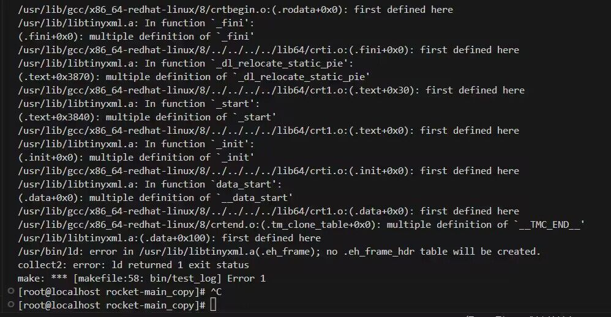

#ROCKET_RPC

## 1.总览
rocket 是基于 C++11 开发的一款多线程的异步 RPC 框架，它旨在高效、简洁的同时，又保持至极高的性能。

rocket 基于主从 Reactor 架构，底层采用 epoll 实现 IO 多路复用。应用层则基于 protobuf 自定义 rpc 通信协议，同时也将支持简单的 HTTP 协议。

rocket 是基于 C++11 开发的异步 RPC 框架，它的特点如下：
- 性能高：主从 Reactor 架构，多线程并发处理. 底层通过 epoll 多路复用
- 异步：支持异步 RPC 调用，主调方需要同步等待返回
- 序列化：基于 Prtobuf 序列化数据，协议轻量化，传输效率高
- 框架化：实现 Generator 代码生成器，一键生成 RPC 框架，提升开发效率.
- 业务解耦：业务开发人员开箱即用，无需关注任何底层框架逻辑
- 异步日志：日志支持按日期、大小滚动；并有异步线程负责输出，提升效率
- 配置化：提供 xml 配置模块，启动时自加载配置文件 

### 1.1 技术栈关键词
- c++11
- protobuf
- rpc
- reactor
- http

## 2. 前置准备
### 2.1 环境搭建
- 开发环境：Linux，可以是虚拟机。推荐跟我保持一致，Centos8 的虚拟机. 包含必要的 C++ 开发工具，如 GCC/G++(至少能支持到 C++11 语法的版本)
- 开发工具：VsCode，通过 ssh 远程连接 linux 机器

### 2.2 依赖库的安装
#### 2.2.1 protobuf
protobuf 推荐使用 3.19.4 及其以上：

安装过程：
```
wget  https://github.com/protocolbuffers/protobuf/releases/download/v3.19.4/protobuf-cpp-3.19.4.tar.gz

tar -xzvf protobuf-cpp-3.19.4.tar.gz
```

我们需要指定 安装路径在 `/usr` 目录下:
```
cd protobuf-cpp-3.19.4

./configure -prefix=/usr/local

make -j4 

sudo make install
```

安装完成后，你可以找到头文件将位于 `/usr/include/google` 下，库文件将位于 `/usr/lib` 下。

#### 2.2.2 tinyxml
项目中使用到了配置模块，采用了 xml 作为配置文件。因此需要安装 libtinyxml 解析 xml 文件。

```
wget https://udomain.dl.sourceforge.net/project/tinyxml/tinyxml/2.6.2/tinyxml_2_6_2.zip

unzip tinyxml_2_6_2.zip

```

### 2.3 日志模块开发
首先需要创建项目：

日志模块：
```
1. 日志级别
2. 打印到文件，支持日期命名，以及日志的滚动。
3. c 格式化风控
4. 线程安全
```

LogLevel:
```
Debug
Info
Error
```

LogEvent:
```
文件名、行号
MsgNo
进程号
Thread id
日期，以及时间。精确到 ms
自定义消息
```

日志格式
```
[Level][%y-%m-%d %H:%M:%s.%ms]\t[pid:thread_id]\t[file_name:line][%msg]
```

Logger 日志器
1.提供打印日志的方法
2.设置日志输出的路径


### 2.4 Reactor
Reactor，又可以称为 EventLoop，它的本质是一个事件循环模型。

Rractor(或称 EventLoop)，它的核心逻辑是一个 loop 循环，使用伪代码描述如下：

```c++{.line-numbers}
void loop() {
  while(!stop) {
      foreach (task in tasks) {
        task();
      }

      // 1.取得下次定时任务的时间，与设定time_out去较大值，即若下次定时任务时间超过1s就取下次定时任务时间为超时时间，否则取1s
      int time_out = Max(1000, getNextTimerCallback());
      // 2.调用Epoll等待事件发生，超时时间为上述的time_out
      int rt = epoll_wait(epfd, fds, ...., time_out); 
      if(rt < 0) {
          // epoll调用失败。。
      } else {
          if (rt > 0 ) {
            foreach (fd in fds) {
              // 添加待执行任务到执行队列
              tasks.push(fd);
            }
          }
      }
      
      
  }
}
```

在 rocket 里面，使用的是主从 Reactor 模型，如下图所示：


服务器有一个mainReactor和多个subReactor。

mainReactor由主线程运行，他作用如下：通过epoll监听listenfd的可读事件，当可读事件发生后，调用accept函数获取clientfd，然后随机取出一个subReactor，将cliednfd的读写事件注册到这个subReactor的epoll上即可。也就是说，mainReactor只负责建立连接事件，不进行业务处理，也不关心已连接套接字的IO事件。

subReactor通常有多个，每个subReactor由一个线程来运行。subReactor的epoll中注册了clientfd的读写事件，当发生IO事件后，需要进行业务处理。

#### 2.4.1 TimerEvent 定时任务
```
1. 指定时间点 arrive_time
2. interval, ms。
3. is_repeated 
4. is_cancled
5. task


cancle()
cancleRepeated()
```

#### 2.4.2 Timer
定时器，他是一个 TimerEvent 的集合。
Timer 继承 FdEvent
```

addTimerEvent();
deleteTimerEvent();

onTimer();    // 当发生了 IO 事件之后，需要执行的方法


reserArriveTime()

multimap 存储 TimerEvent <key(arrivetime), TimerEvent>
```

#### 2.5 IO 线程
创建一个IO 线程，他会帮我们执行：
1. 创建一个新线程（pthread_create）
2. 在新线程里面 创建一个 EventLoop，完成初始化
3. 开启 loop
```
class {


 pthread_t m_thread;
 pid_t m_thread_id;
 EventLoop event_loop;
}

```

RPC 服务端流程
```
启动的时候就注册OrderService 对象。


1. 从buufer读取数据，然后 decode 得到请求的 TinyPBProtobol 对象。然后从请求的 TinyPBProtobol 得到 method_name, 从 OrderService 对象里根据 service.method_name 找到方法 func
2. 找到对应的 requeset type 以及 response type
3. 将请求体 TinyPBProtobol 里面的 pb_date 反序列化为 requeset type 的一个对象, 声明一个空的 response type 对象
4. func(request, response)
5. 将 reponse 对象序列为 pb_data。 再塞入到 TinyPBProtobol 结构体中。做 encode 然后塞入到buffer里面，就会发送回包了
```


# 遇到问题
## 1.库文件安装路径
### 1.1 tinyxml
以tinyxml 为例，tinyxml 分为库文件 `libtinyxml.a` 和头文件 `tinyxml/*.h`

其中库文件一定需要安装在 `/usr/lib` 目录下，即绝对路径为 `/usr/lib/libtinyxml.a` ，如果不一致，拷贝过去

而头文件，所有 `*.h` 的头文件，必须位于 `tinyxml/` 目录下，而整个 `tinyxml` 目录需要放在 `usr/include` 下，即绝对路径为 `/usr/include/tinyxml`, `tinyxml` 下包含所有的 `.h` 结尾的头文件

### 1.2 protobuf
同 tinyxml，库文件在 `/usr/lib/libprotobuf.a`, 所有头文件 `*.h` 在 `/usr/include/google/protobuf/` 下


## 2. 如何确保 protobuf 库安装成功？
1. 确保头文件、库文件安装无误
2. 确保能 执行 protoc 命令
```
[ikerli@localhost protobuf]$ protoc --version
libprotoc 3.19.4
```


## 3. invalid version 3(max 0)
出现此问题，一般是安装的 libtinyxml.a 有问题，使用以下代码替换原始 tinyxml 的makefile, 然后重装 libtinyxml.a
```
#****************************************************************************
#
# Makefile for TinyXml test.
# Lee Thomason
# www.grinninglizard.com
#
# This is a GNU make (gmake) makefile
#****************************************************************************

# DEBUG can be set to YES to include debugging info, or NO otherwise
DEBUG          := NO

# PROFILE can be set to YES to include profiling info, or NO otherwise
PROFILE        := NO

# TINYXML_USE_STL can be used to turn on STL support. NO, then STL
# will not be used. YES will include the STL files.
TINYXML_USE_STL := NO

#****************************************************************************

CC     := gcc
CXX    := g++
LD     := g++
AR     := ar rc
RANLIB := ranlib

DEBUG_CFLAGS     := -Wall -Wno-format -g -DDEBUG
RELEASE_CFLAGS   := -Wall -Wno-unknown-pragmas -Wno-format -O3

LIBS		 :=

DEBUG_CXXFLAGS   := ${DEBUG_CFLAGS} 
RELEASE_CXXFLAGS := ${RELEASE_CFLAGS}

DEBUG_LDFLAGS    := -g
RELEASE_LDFLAGS  :=

ifeq (YES, ${DEBUG})
   CFLAGS       := ${DEBUG_CFLAGS}
   CXXFLAGS     := ${DEBUG_CXXFLAGS}
   LDFLAGS      := ${DEBUG_LDFLAGS}
else
   CFLAGS       := ${RELEASE_CFLAGS}
   CXXFLAGS     := ${RELEASE_CXXFLAGS}
   LDFLAGS      := ${RELEASE_LDFLAGS}
endif

ifeq (YES, ${PROFILE})
   CFLAGS   := ${CFLAGS} -pg -O3
   CXXFLAGS := ${CXXFLAGS} -pg -O3
   LDFLAGS  := ${LDFLAGS} -pg
endif

#****************************************************************************
# Preprocessor directives
#****************************************************************************

ifeq (YES, ${TINYXML_USE_STL})
  DEFS := -DTIXML_USE_STL
else
  DEFS :=
endif

#****************************************************************************
# Include paths
#****************************************************************************

#INCS := -I/usr/include/g++-2 -I/usr/local/include
INCS :=


#****************************************************************************
# Makefile code common to all platforms
#****************************************************************************

CFLAGS   := ${CFLAGS}   ${DEFS}
CXXFLAGS := ${CXXFLAGS} ${DEFS}

#****************************************************************************
# Targets of the build
#****************************************************************************

OUTPUT := libtinyxml.a 

all: ${OUTPUT}


#****************************************************************************
# Source files
#****************************************************************************

SRCS := tinyxml.cpp tinyxmlparser.cpp xmltest.cpp tinyxmlerror.cpp tinystr.cpp

# Add on the sources for libraries
SRCS := ${SRCS}

OBJS := $(addsuffix .o,$(basename ${SRCS}))

#****************************************************************************
# Output
#****************************************************************************

${OUTPUT}: ${OBJS}
	${AR} $@ ${LDFLAGS} ${OBJS} ${LIBS} ${EXTRA_LIBS}

#****************************************************************************
# common rules
#****************************************************************************

# Rules for compiling source files to object files
%.o : %.cpp
	${CXX} -c ${CXXFLAGS} ${INCS} $< -o $@

%.o : %.c
	${CC} -c ${CFLAGS} ${INCS} $< -o $@

dist:
	bash makedistlinux

clean:
	-rm -f core ${OBJS} ${OUTPUT}

depend:
	#makedepend ${INCS} ${SRCS}

tinyxml.o: tinyxml.h tinystr.h
tinyxmlparser.o: tinyxml.h tinystr.h
xmltest.o: tinyxml.h tinystr.h
tinyxmlerror.o: tinyxml.h tinystr.h
```

## 4. multiple definition of __TMC_END__
编译时出现以下多重定义错误


处理方法同问题3，重新安装 libtinyxml.a 即可


## 5. testcases/order.pb.cc: No such file or directory
```
-Wno-unused-but-set-variable -I./ -Irocket  -Irocket/common -Irocket/net -Irocket/net/tcp -Irocket/net/coder -Irocket/net/rpc testcases/test_rpc_client.cc testcases/order.pb.cc -o bin/test_rpc_client lib/librocket.a /usr/lib/libprotobuf.a    /usr/lib/libtinyxml.a -ldl -pthread
g++: error: testcases/order.pb.cc: No such file or directory
make: *** [makefile:71: bin/test_rpc_client] Error 1
make: *** Waiting for unfinished jobs....
```
出现此错误时，是因为本地没有用 `protoc` 命令生成文件，需要执行：
```
cd testcases
protoc --cpp_out=./ order.proto
```
观察是否在当前目录生成了 `order.pb.h` 和 `order.pb.cc` 两个文件，生成成功后重新编译


# 性能测试
Rocket-RPC 底层使用的是 Reactor 架构，同时又结合了多线程，其性能是能得到保障的。进行几个简单的性能测试结果如下：
### 2.1. HTTP echo 测试 QPS
测试机配置信息：Centos**虚拟机**，内存**6G**，CPU为**4核**

测试工具：**wrk**: https://github.com/wg/wrk.git

部署信息：wrk 与 Rocket-RPC 服务部署在同一台虚拟机上, 关闭 TinyRPC 日志

测试命令：
```
// -c 为并发连接数，按照表格数据依次修改
wrk -c 1000 -t 8 -d 30 --latency 'http://127.0.0.1:19999/qps?id=1'
```

测试结果：
|  **QPS** | **WRK 并发连接 1000** | **WRK 并发连接 2000** | **WRK 并发连接 5000** | **WRK 并发连接 10000** |
|  ----  | ----  | ---- | ---- | ---- |
| IO线程数为 **1** | **27000 QPS** | **26000 QPS** | **20000 QPS** |**20000 QPS** |
| IO线程数为 **4** | **140000 QPS** | **130000 QPS** | **123000 QPS**| **118000 QPS** |
| IO线程数为 **8** | **135000 QPS** | **120000 QPS**| **100000 QPS**| **100000 QPS** |
| IO线程数为 **16** | **125000 QPS** | **127000 QPS** |**123000 QPS** | **118000 QPS** |

```
// IO 线程为 4, 并发连接 1000 的测试结果
[ikerli@localhost bin]$ wrk -c 1000 -t 8 -d 30 --latency 'http://127.0.0.1:19999/qps?id=1'
Running 30s test @ http://127.0.0.1:19999/qps?id=1
  8 threads and 1000 connections
  Thread Stats   Avg      Stdev     Max   +/- Stdev
    Latency     9.79ms   63.83ms   1.68s    99.24%
    Req/Sec    17.12k     8.83k   97.54k    72.61%
  Latency Distribution
     50%    4.37ms
     75%    7.99ms
     90%   11.65ms
     99%   27.13ms
  4042451 requests in 30.07s, 801.88MB read
  Socket errors: connect 0, read 0, write 0, timeout 205
Requests/sec: 134442.12
Transfer/sec:     26.67MB
```

由以上测试结果，**Rocket-RPC 框架的 QPS 可达到 14W 左右**。
